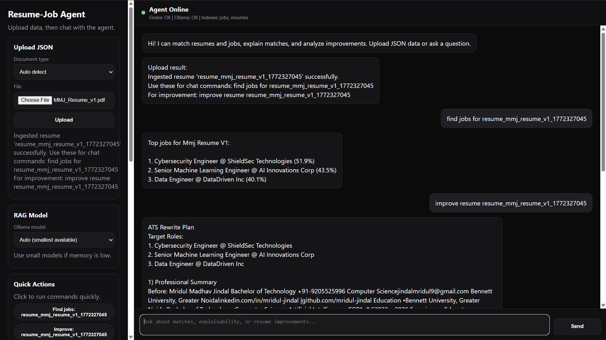

# Resume-Job Matcher (Endee Vector DB)

AI/ML project that matches resumes to jobs using semantic vector search, with optional RAG explanations.



## 1) Project Overview

### Problem Statement
Recruiters and candidates waste time on keyword matching that misses semantic meaning (for example, "NLP Engineer" vs "LLM Developer").

### Goal
Build a practical matching system where vector search is core, so similar skills/experience are matched even when wording differs.

### Practical Use Cases Covered
- Semantic Search (primary)
- Recommendation-style ranking (top jobs for a resume, top candidates for a role)
- RAG (Retrieval Augmented Generation) explanations via Ollama (optional)

## 2) Technical Approach

### System Design

The application follows a modular retrieval architecture where Endee is the vector retrieval core and FastAPI/TUI provide interaction layers.

**Layers and responsibilities**
- **Input Layer**: JSON/PDF/DOCX upload and chat commands from web UI or TUI
- **Ingestion Layer**: parsing + schema validation + dedup (`app/pipeline.py`, `app/schema.py`)
- **Embedding Layer**: semantic vector generation using `sentence-transformers` (`app/embedder.py`)
- **Vector Storage/Retrieval Layer**: Endee indexes (`resumes`, `jobs`) via REST client (`app/endee_client.py`)
- **Matching Layer**: ranking and recommendation logic (`app/match.py`)
- **Explanation Layer (optional)**: RAG generation through Ollama (`app/rag.py`)
- **Serving Layer**: API/chat endpoints (`app/web_server.py`) and terminal workflow (`app/tui.py`)

**End-to-end data flow**
1. User uploads or selects resume/job data
2. Data is validated and normalized
3. Text is embedded into 384-d vectors
4. Vectors + metadata are stored in Endee indexes
5. Query embedding is generated from user input or selected entity
6. Endee returns top-k nearest matches
7. Results are formatted as recommendations
8. Optional: retrieved context is sent to Ollama for RAG explanation/improvement output

### Pipeline
1. Load resume/job JSON documents
2. Validate schema
3. Convert text to embeddings using `sentence-transformers` (`all-MiniLM-L6-v2`, 384-dim)
4. Store vectors in Endee indexes (`resumes`, `jobs`)
5. Query nearest neighbors for matching
6. (Optional) Send retrieved context to Ollama for natural-language explanations

### Core Components
- `app/pipeline.py`: ingestion + validation + dedup + dry-run
- `app/match.py`: search and ranking logic
- `app/tui.py`: terminal UI for interactive usage
- `app/web_server.py`: FastAPI backend for ChatGPT-like web interface + upload APIs
- `app/rag.py`: RAG workflows with Ollama
- `app/endee_client.py`: Endee REST client
- `web/`: dark grey/black chat frontend (HTML/CSS/JS)

## 3) How Endee Is Used

Endee is the vector database and retrieval engine.

- Index creation:
  - `resumes` index (384 dimensions)
  - `jobs` index (384 dimensions)
- Vector insert:
  - Each document is inserted with an ID, embedding vector, and filter metadata
- Search:
  - KNN similarity search retrieves top-k matches
  - Optional filters (experience, location, remote/open-to-work)

Endee is accessed through REST endpoints via `app/endee_client.py`.

## 4) Setup and Execution

## Prerequisites
- Python 3.8+
- Docker Desktop running
- PowerShell (Windows)
- Optional for RAG: Ollama

## Start Endee
```powershell
docker run -d --name endee-server -p 8080:8080 endeeio/endee-server:latest
```

## Python Environment
```powershell
cd resume-job-matcher
python -m venv venv
.\venv\Scripts\Activate.ps1
pip install -r requirements.txt
```

## Ingest Data
```powershell
cd app
python pipeline.py --dry-run
python pipeline.py --force
```

## Run the App
```powershell
python tui.py
```

## Run ChatGPT-like Web Interface 
```powershell
cd app
uvicorn web_server:app --host 0.0.0.0 --port 8000 --reload
```

Open: `http://localhost:8000`

Features:
- Upload resume/job JSON, PDF, or DOCX files from UI
- Chat with agent for matching and analysis
- Commands like: `find jobs for resume_001`, `find candidates for job_003`, `explain match resume_001 job_001`

Notes for PDF/DOCX uploads:
- If `Document type` is `Auto detect`, the system uses filename hints and defaults to `resume`.
- For best results, choose `resume` or `job` explicitly when uploading PDF/DOCX.

## Quick Non-UI Demo
```powershell
python match.py --demo
```

## Optional RAG Setup
```powershell
ollama serve
ollama pull llama3.2
```
Then use TUI menu option `6`.

## 5) Expected Outputs (Examples)

After ingestion:
- 15 resumes loaded and ingested
- 15 jobs loaded and ingested

During matching:
- Top matching jobs for a selected resume with similarity scores
- Top matching candidates for a selected job with similarity scores
- Chat interface returns ranked matches and optional RAG explanations

## 6) Project Structure

```text
resume-job-matcher/
├─ app/
│  ├─ pipeline.py
│  ├─ match.py
│  ├─ tui.py
│  ├─ web_server.py
│  ├─ rag.py
│  ├─ endee_client.py
│  └─ schema.py
├─ data/
│  ├─ resumes/
│  └─ jobs/
├─ web/
│  ├─ index.html
│  ├─ style.css
│  └─ app.js
├─ requirements.txt
└─ README.md
```

## 7) Assignment Submission Checklist

Use this checklist before sharing on GitHub.

- [x] Well-defined AI/ML project using Endee as vector database
- [x] Practical vector-first use case implemented (semantic search + recommendations)
- [x] Optional RAG workflow implemented
- [x] Hosted on GitHub as complete project repository
- [x] README includes project overview and problem statement
- [x] README includes system design and technical approach
- [x] README explains how Endee is used
- [x] README includes clear setup and run instructions

